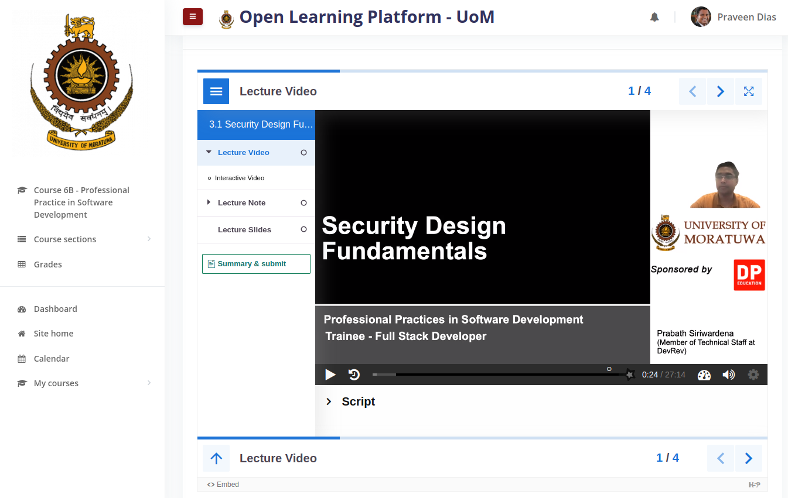
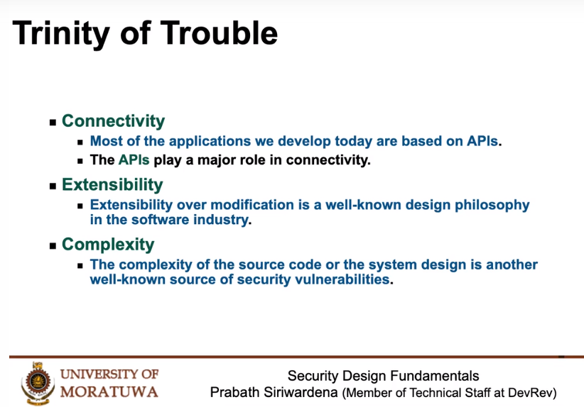
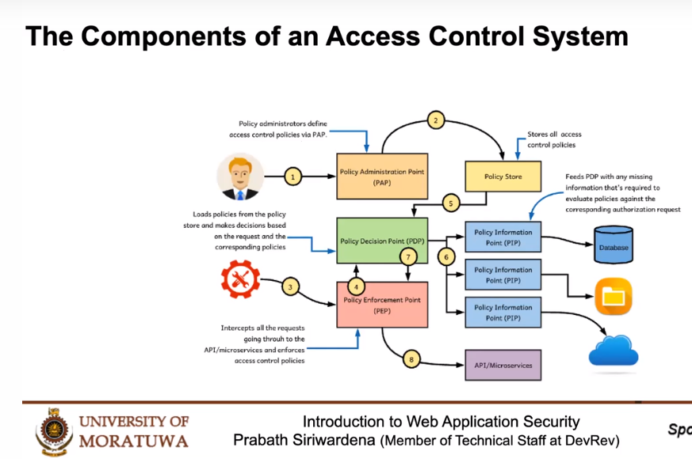
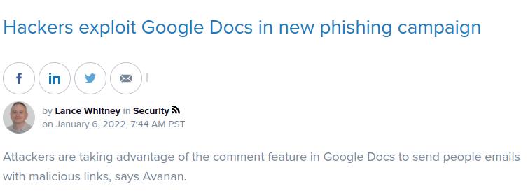
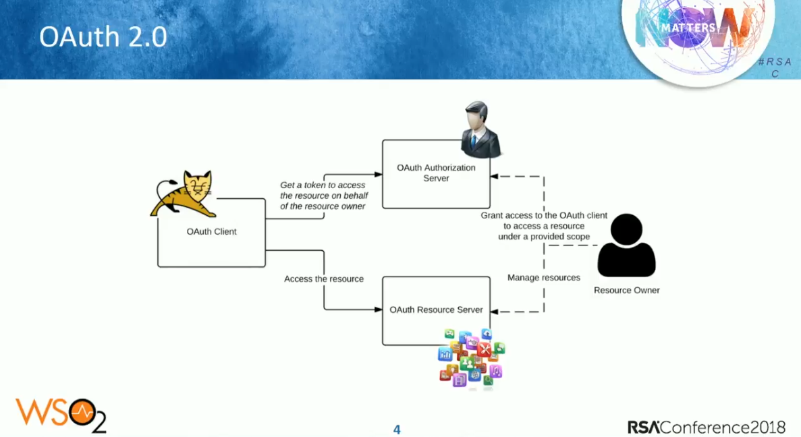
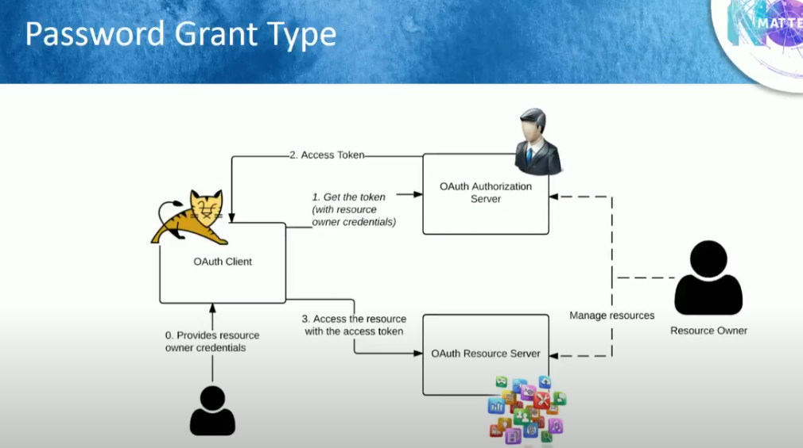
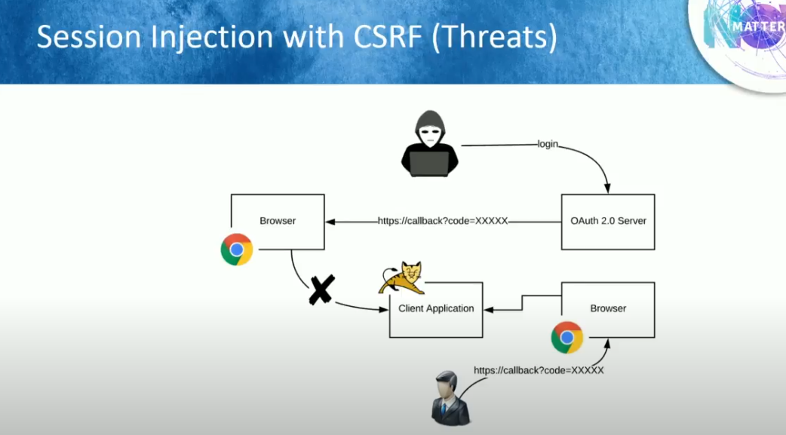
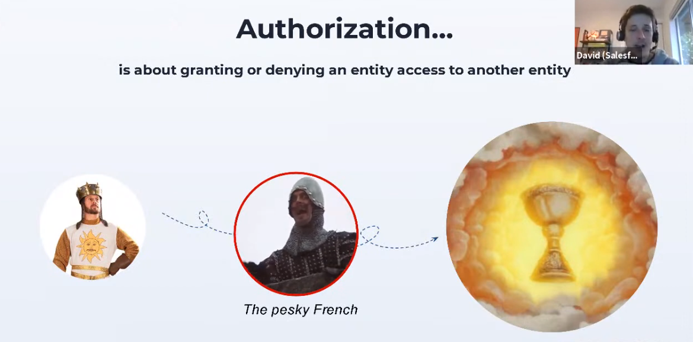

# Security Design Fundamentals

 

 ## Trinity of Trouble

 

 ## Weekest Link

 

 ## Components of an ACS

 

 ## Google Docs Phishing Attacks

 

 # Auth 2.0

 

 ## Avoid Password Grant!!

 

 ## CSRF

Attackers session is injected to the victim.

 

 # What is Authorization

 